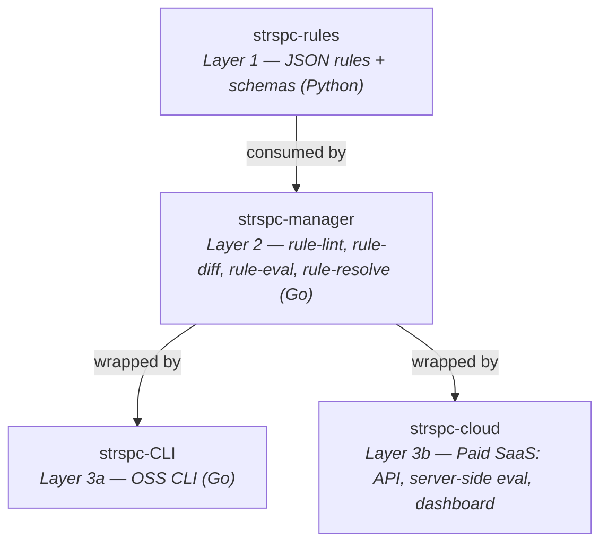

# strspc-manager

SteerSpec Rule Manager — core enforcement engine. Go.

## Architecture

The manager is the **core engine** (Layer 2) in the SteerSpec 3-tier architecture:



All validation and evaluation logic lives here. The CLI and cloud service
import the manager's public Go packages — they never implement rule logic directly.

See [strspc-rules#17](https://github.com/SteerSpec/strspc-rules/issues/17)
for the full architecture decision.

## Packages

Public packages under `src/` — importable by strspc-CLI and strspc-cloud:

```go
import "github.com/SteerSpec/strspc-manager/src/entity"      // shared domain types
import "github.com/SteerSpec/strspc-manager/src/result"       // shared diagnostic types
import "github.com/SteerSpec/strspc-manager/src/schema"       // schema fetch + cache
import "github.com/SteerSpec/strspc-manager/src/rulelint"     // stateless entity validator
import "github.com/SteerSpec/strspc-manager/src/rulediff"     // PR lifecycle validator
import "github.com/SteerSpec/strspc-manager/src/ruleeval"     // AI-powered evaluation
import "github.com/SteerSpec/strspc-manager/src/ruleresolve"  // rule fetch + cache
import "github.com/SteerSpec/strspc-manager/src/realmlint"    // Realm directory validator
import "github.com/SteerSpec/strspc-manager/src/realmresolve" // Realm dependency resolver
```

### Foundation

| Package | Description |
| ------- | ----------- |
| `entity` | Shared domain types: `File`, `Entity`, `RuleSet`, `Rule`, `Note`, `RealmFile`. Includes `Parse([]byte)` and `Load(path)` for both file and HTTP consumers. |
| `result` | Shared `Diagnostic`, `Severity`, and `Result` types returned by all modules. |
| `schema` | Fetches and caches JSON schemas from `steerspec.dev` at runtime. No embedded copies — single source of truth via strspc-www. |

### Modules

| Package | Type | Description |
| ------- | ---- | ----------- |
| `rulelint` | deterministic, stateless | Validates entity files against schema and business rules (§7.1) |
| `rulediff` | deterministic, stateful | Validates rule lifecycle transitions across PR diffs (§7.2) |
| `ruleeval` | AI, pluggable providers | Evaluates code compliance against rules. Supports Claude, OpenAI, Ollama, and static-only mode. |
| `ruleresolve` | deterministic | Fetches, caches, and resolves rules from configured sources (§8.2) |
| `realmlint` | deterministic, stateless | Validates Realm structure, `realm.json` manifest, and EUID uniqueness |
| `realmresolve` | deterministic | Resolves Realm dependencies declared in `realm.json` and fetches remote Realms |

## Rule sources

The manager consumes rules and schemas published at
[steerspec.dev](https://steerspec.dev) from
[strspc-rules](https://github.com/SteerSpec/strspc-rules):

| Resource | URL |
| -------- | --- |
| Entity schema | `https://steerspec.dev/schemas/entity/v1.json` |
| Realm schema | `https://steerspec.dev/schemas/realm/v1.json` |
| Bootstrap schema | `https://steerspec.dev/schemas/entity/bootstrap.json` |
| Rules manifest | `https://steerspec.dev/rules/latest/index.json` |
| Versioned rules | `https://steerspec.dev/rules/v<version>/` |

## Realms

Rules are organized into **Realms** — namespaces where Entity Unique Identifiers
(EUIDs) are unique. A Realm is any directory containing entity files and a
`realm.json` manifest:

- `strspc-rules/rules/core/` — the **core** Realm (ships with SteerSpec)
- An org spec repo — an **organizational** Realm
- `./rules/` in a consumer project — a **local** Realm

See [strspc-rules#19](https://github.com/SteerSpec/strspc-rules/issues/19)
for the full Realm architecture.

## References

- [strspc-rules#4](https://github.com/SteerSpec/strspc-rules/issues/4) — Rule Manager specification
- [strspc-rules#17](https://github.com/SteerSpec/strspc-rules/issues/17) — 3-tier platform architecture
- [strspc-rules#19](https://github.com/SteerSpec/strspc-rules/issues/19) — Realm formalization
