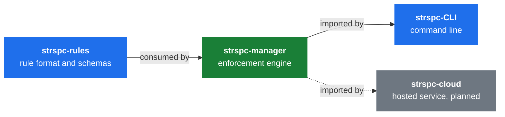

<div align="center">


# SteerSpec Rule Manager

**The core enforcement engine of SteerSpec: a Go library that validates, diffs, evaluates and resolves rules.**

[](https://github.com/SteerSpec/strspc-manager/actions/workflows/ci.yml)
[](https://github.com/SteerSpec/strspc-manager/releases)
[](https://pkg.go.dev/github.com/SteerSpec/strspc-manager)
[](go.mod)
[](LICENSE)

[Architecture](#architecture) · [Quick start](#quick-start) · [Packages](#packages) · [Evaluation providers](#evaluation-providers) ·
[Rule sources](#rule-sources) · [Realms](#realms) · [Development](#development) · [Releases](#branching-and-releases) · [References](#references) · [License](#license)

</div>

## Architecture

The manager is the middle tier of the SteerSpec platform:


```mermaid
flowchart LR
	R["<b>strspc-rules</b><br/>rule format and schemas"]
	M["<b>strspc-manager</b><br/>enforcement engine"]
	C["<b>strspc-CLI</b><br/>command line"]
	K["<b>strspc-cloud</b><br/>hosted service, planned"]

	R -->|consumed by| M
	M -->|imported by| C
	M -.->|imported by| K

	classDef here fill:#1a7f37,stroke:#1a7f37,color:#ffffff
	classDef shipped fill:#1f6feb,stroke:#1f6feb,color:#ffffff
	classDef planned fill:#6e7781,stroke:#6e7781,color:#ffffff
	class M here
	class R,C shipped
	class K planned
```

All validation and evaluation logic lives here. Its consumers import the manager's public Go
packages and only present the results, so they never implement rule logic directly.

## Quick start

```bash
go get github.com/SteerSpec/strspc-manager@latest
```

Lint a Realm against the schemas of the core version it pins:

```go
package main

import (
	"context"
	"fmt"
	"os"

	"github.com/SteerSpec/strspc-manager/src/rulelint"
	"github.com/SteerSpec/strspc-manager/src/schema"
)

func main() {
	fetcher := schema.New(schema.ForRealm("rules")...)
	linter := rulelint.New(rulelint.WithSchemaFetcher(fetcher))

	res := linter.LintRealm(context.Background(), "rules")
	for _, d := range res.Diagnostics {
		fmt.Println(d)
	}
	if !res.OK() {
		os.Exit(1)
	}
}
```

Most users want [`strspc`](https://github.com/SteerSpec/strspc-CLI), the command line built on this
library. Releases also ship a small `strspc-manager` binary with `version` and `realm-lint`.

## Packages

Public packages live under `src/`, for example
`github.com/SteerSpec/strspc-manager/src/rulelint`. Section numbers (§) refer to
[`docs/SPEC.md`](docs/SPEC.md).

### Foundation

| Package | Description |
| ------- | ----------- |
| `entity` | Shared domain types: `File`, `Entity`, `RuleSet`, `Rule`, `Note`, `RealmFile`. Includes `Parse([]byte)` and `Load(path)` for both file and HTTP consumers, the rule state machine, and the closed note-type enum (`NoteTypes`, `IsAppendOnlyNoteType`). |
| `entityops` | Mutations of an entity file that keep it valid: create an entity, add, edit, promote, retire, abandon and supersede rules, add and revise notes. `NewFile` starts a file at `rule_set.version` 0.1.0; every other operation changes an existing file and bumps that version (minor on promote/retire, patch otherwise). All of them refresh the timestamp and hash (§2.4). Operations act on the `File` they are given; callers bump the ancestors of a sub-entity. |
| `result` | Shared `Diagnostic`, `Severity`, and `Result` types returned by all modules. |
| `schema` | Fetches and caches JSON schemas from `steerspec.dev` at runtime. `ForRealm` selects the core version a Realm pins, so a schema change reaches it through its pin. A test keeps embedded copies out of the binary. |
| `remote` | Fetches `github://` rule directories through the GitHub REST tarball endpoint and caches them locally (§6.4). Shared by `ruleresolve` and `realmresolve`, and limits which repository owners receive the GitHub token. |
| `render` | Renders entity files to human-readable formats; Markdown today, with an optional custom template (`WithTemplate`). Rule IDs are displayed in the RLIFRMT default format unless a Realm's `rule_identifier_format` is passed through `NewRuleIDFormatter` and `WithRuleIDFormatter`. `WithInheritance` adds an "Inherited rules" section. |
| `inherit` | Computes the effective rule set of an entity from a resolved inheritance chain. |

### Modules

| Package | Type | Description |
| ------- | ---- | ----------- |
| `rulelint` | deterministic, stateless | Validates entity files against schema and business rules (§7.1) |
| `rulediff` | deterministic, stateful | Validates rule lifecycle transitions across PR diffs (§7.2) |
| `ruleeval` | AI, pluggable providers | Evaluates code compliance against rules (§8.3). Batches rules per entity, caches verdicts, and degrades to static-only mode when no provider is configured. See [Evaluation providers](#evaluation-providers). |
| `evalcache` | deterministic | Persists `ruleeval` verdicts in an embedded key-value store at `.strspc/cache.db` with TTL expiry (§8.4) |
| `ruleresolve` | deterministic | Fetches, caches, and resolves rules from configured sources (§8.2) |
| `realmlint` | deterministic, stateless | Validates Realm structure, `realm.json` manifests including sub-realms, EUID uniqueness, and the Realm against its pinned dependencies |
| `realmresolve` | deterministic | Resolves Realm dependencies declared in `realm.json`, fetches remote Realms, and resolves inheritance chains across Realms |

## Evaluation providers

`ruleeval/providers.New(name, opts)` builds a provider from the `evaluator.provider`
value in `.strspc/config.yaml`:

| Provider | Status | Notes |
| -------- | ------ | ----- |
| `claude` | available | Anthropic Messages API via `ruleeval/claude`. Default model `claude-sonnet-5-5`, effort `medium`; structured outputs (verdicts keyed by rule id, then one detail request per violated rule that confirms or withdraws it); prompt caching on the system prompt and diff; API key from `ANTHROPIC_API_KEY` (workspace-scoped). |
| `static-only` (also `static`, `null` or omitted) | available | No AI calls; `ruleeval` emits `RE003` and only structural checks run. |
| `openai` | planned | Returns `ErrProviderNotImplemented` ([#67](https://github.com/SteerSpec/strspc-manager/issues/67)). |
| `ollama` | planned | Returns `ErrProviderNotImplemented` ([#67](https://github.com/SteerSpec/strspc-manager/issues/67)). |

Provider tests replay recorded HTTP cassettes from `src/ruleeval/claude/testdata/cassettes/`
and never call the network in CI. Set `STRSPC_RECORD=1` with an API key to re-record,
or run the live smoke test with `go test -tags live ./src/ruleeval/claude/`.

A GitHub Models provider is proposed in [#79](https://github.com/SteerSpec/strspc-manager/issues/79).

## Rule sources

The manager consumes rules and schemas published at
[steerspec.dev](https://steerspec.dev) from
[strspc-rules](https://github.com/SteerSpec/strspc-rules):

| Resource | URL |
| -------- | --- |
| Entity schema | `https://steerspec.dev/schemas/entity/v1.json` |
| Realm schema | `https://steerspec.dev/schemas/realm/v1.json` |
| Bootstrap schema | `https://steerspec.dev/schemas/entity/bootstrap.json` |
| Rules manifest | `https://steerspec.dev/rules/latest/index.json` |
| Versioned rules | `https://steerspec.dev/rules/v<version>/` |
| Versioned schemas | `https://steerspec.dev/rules/v<version>/_schema/` |

## Realms

Rules are organized into **Realms** — namespaces where Entity Unique Identifiers
(EUIDs) are unique. A Realm is any directory containing entity files and a
`realm.json` manifest:

- `strspc-rules/rules/core/` — the **core** Realm (ships with SteerSpec)
- An org spec repo — an **organizational** Realm
- `./rules/` in a consumer project — a **local** Realm
- `rules/` in this repository — `dev.steerspec.manager`, the engine's own rules,
	validated and evaluated in CI with the released CLI

## Development

```bash
make setup   # install the pre-commit hooks
make build   # build the strspc-manager binary
make test    # run the tests
make lint    # run golangci-lint
make fmt     # format the code
```

CI runs the tests with `go test -race ./...`. See
[`AGENTS.md`](AGENTS.md) for the agent workflow and the
[SteerSpec contributing guide](https://github.com/SteerSpec/.github/blob/main/CONTRIBUTING.md) for
everything else.

## Branching and releases

`develop` is the default branch and collects the changes for the next release;
`main` only moves when a release is prepared:

1. Pull requests target `develop` and are **squashed**. The pull request title
	becomes the commit release-please reads, so it decides the release note and
	the version bump. A merge commit would list the change twice.
2. A `chore: promote develop to main` pull request carries the bundle to `main`.
	Merge it with a **merge commit**: release-please reads the individual
	conventional commits, and a squash would hide them behind a single `chore:`.
3. release-please opens its release pull request against `main`; merging it tags
	the version and GoReleaser publishes it.

> [!IMPORTANT]
> Promote `develop` before merging a release pull request. release-please stops
> reading at the last release commit, by date, so a `feat:` or `fix:` left on
> `develop` while a release merges is dropped from the next release.

The `merge-method-develop` and `merge-method-main` rulesets enforce both merge
methods. `develop` is not back-merged, so it stays behind `main` by the release
commits.

## References

- [`docs/SPEC.md`](docs/SPEC.md) — canonical Rule Manager specification
- [strspc-spec](https://github.com/SteerSpec/strspc-spec) — the cross-cutting platform rules
- [strspc-rules#17](https://github.com/SteerSpec/strspc-rules/issues/17) — 3-tier platform architecture decision
- [strspc-rules#19](https://github.com/SteerSpec/strspc-rules/issues/19) — Realm formalization decision

## License

Apache 2.0, see [LICENSE](LICENSE).
